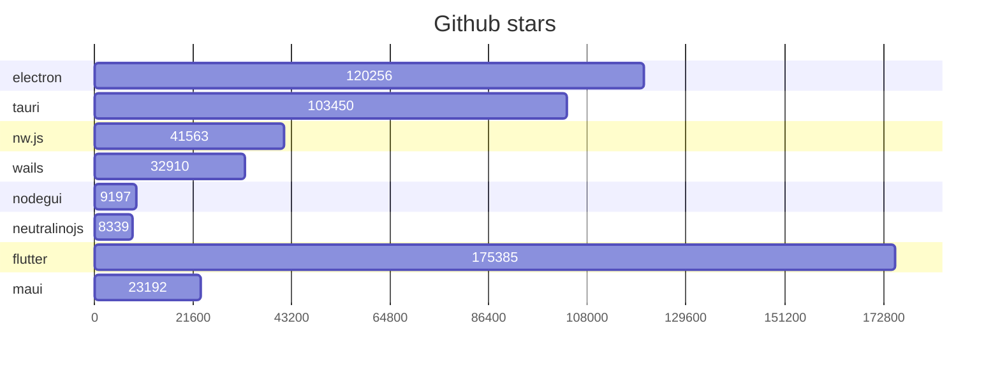

# Graphs

## Stars

```mermaid
gantt
    title Github stars
    dateFormat  X
    axisFormat %s


	section electron
	120256 : 0, 120256

	
	section tauri
	103450 : 0, 103450

	
	section nw.js
	41563 : 0, 41563

	
	section wails
	32910 : 0, 32910

	
	section nodegui
	9197 : 0, 9197

	
	section neutralinojs
	8339 : 0, 8339

	
	section flutter
	175385 : 0, 175385

	
	section maui
	23192 : 0, 23192

	
```

## Forks

```mermaid
gantt
    title Github forks
    dateFormat  X
    axisFormat %s


	section electron
	17016 : 0, 17016

	
	section tauri
	3413 : 0, 3413

	
	section nw.js
	3870 : 0, 3870

	
	section wails
	1605 : 0, 1605

	
	section nodegui
	309 : 0, 309

	
	section neutralinojs
	480 : 0, 480

	
	section flutter
	30069 : 0, 30069

	
	section maui
	1918 : 0, 1918

	
```
