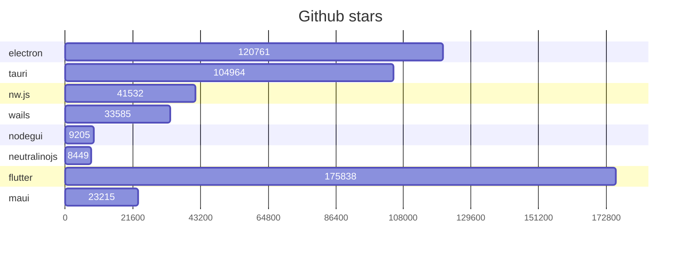
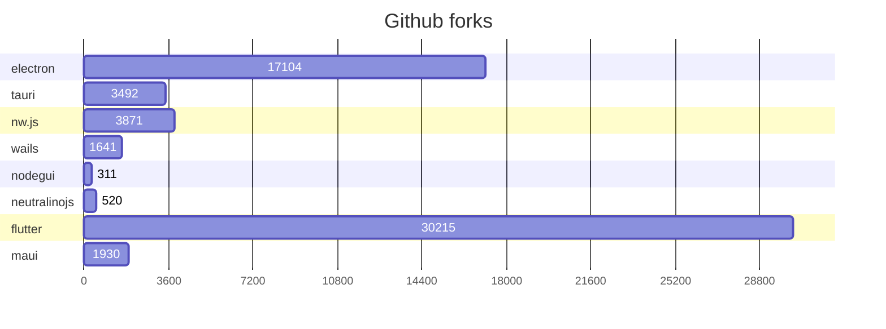

# Graphs

## Stars

```mermaid
gantt
    title Github stars
    dateFormat  X
    axisFormat %s


	section electron
	120761 : 0, 120761

	
	section tauri
	104964 : 0, 104964

	
	section nw.js
	41532 : 0, 41532

	
	section wails
	33585 : 0, 33585

	
	section nodegui
	9205 : 0, 9205

	
	section neutralinojs
	8449 : 0, 8449

	
	section flutter
	175838 : 0, 175838

	
	section maui
	23215 : 0, 23215

	
```

## Forks

```mermaid
gantt
    title Github forks
    dateFormat  X
    axisFormat %s


	section electron
	17104 : 0, 17104

	
	section tauri
	3492 : 0, 3492

	
	section nw.js
	3871 : 0, 3871

	
	section wails
	1641 : 0, 1641

	
	section nodegui
	311 : 0, 311

	
	section neutralinojs
	520 : 0, 520

	
	section flutter
	30215 : 0, 30215

	
	section maui
	1930 : 0, 1930

	
```
